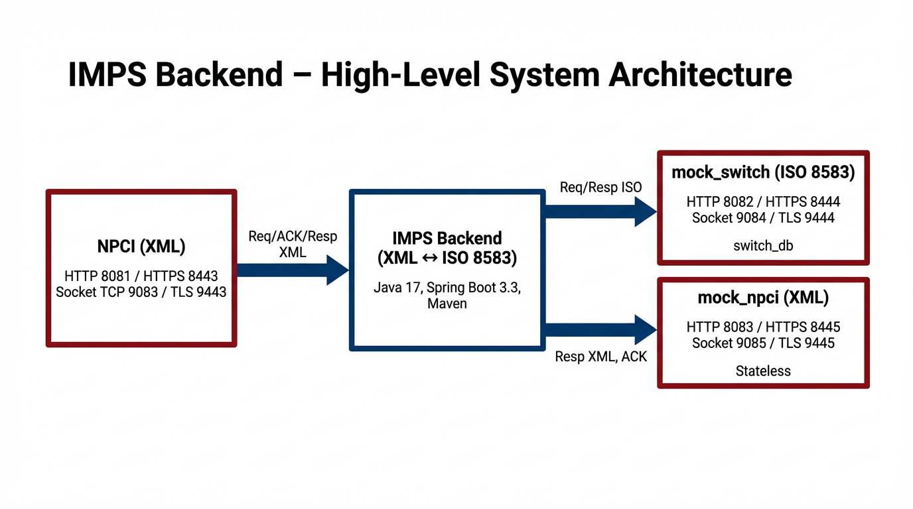
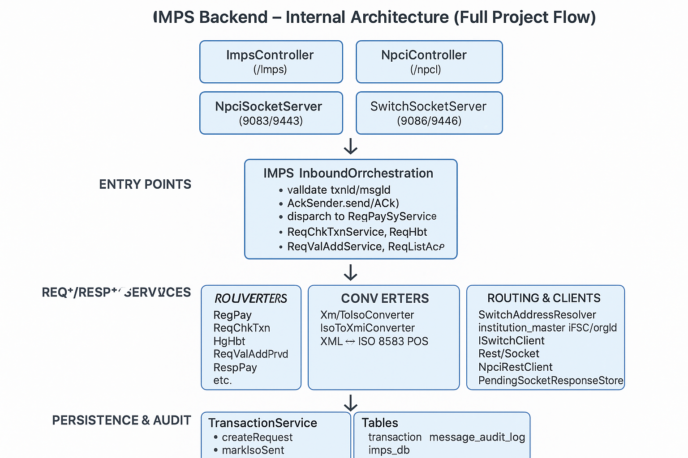
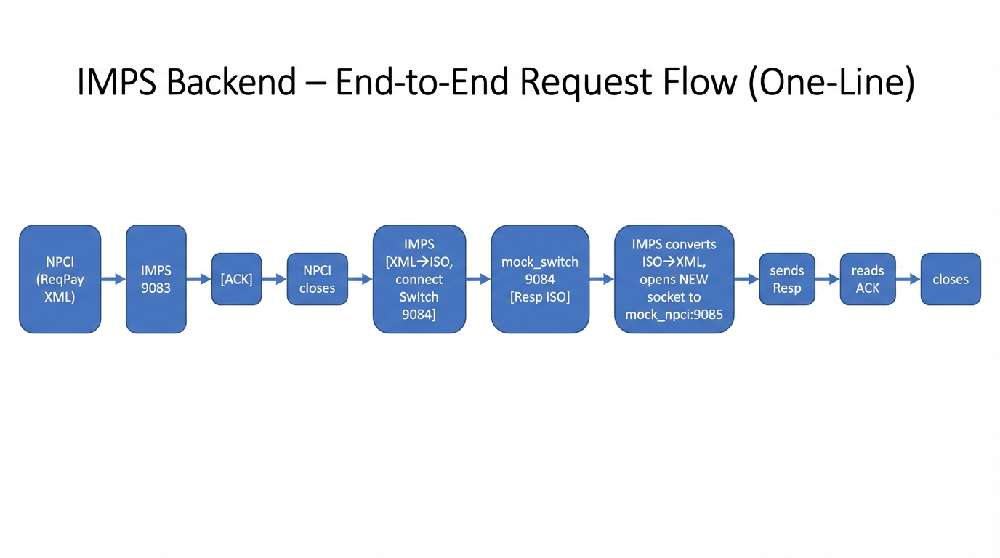
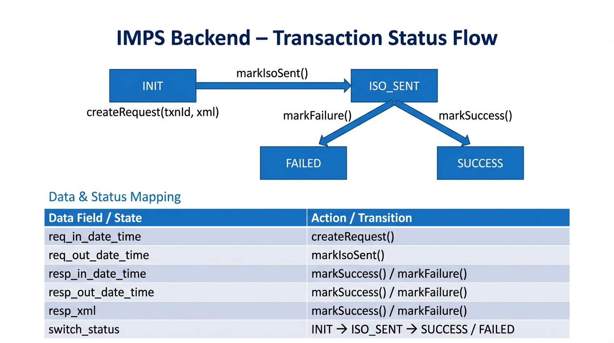

# SVKM's NMIMS  
## Mukesh Patel School of Technology Management & Engineering  
## Department of Computer Engineering  

---

# A REPORT ON  
# **"IMPS Backend Transaction Processing System"**  
## Phase 1 – Foundation  

## By  
## Rugved Manoj Kharde  
## 70612400081  
## A029  
## Master of Computer Applications (MCA)  

### Hitachi Payment Services Pvt. Ltd.  

### May 2026  

---

# A PROJECT REPORT ON  
# **"IMPS Backend Transaction Processing System – Phase 1"**  
## By  
## Rugved Manoj Kharde  

A Report submitted in partial fulfilment of the requirements of 2 years Master of Computer Applications (MCA) Program of Mukesh Patel School of Technology, Management and Engineering, NMIMS.

---

### Under the Supervision of:

**Industry Mentor**  
Mr. Chetan Mokashi  
(Deputy Vice President at Hitachi Payments Ltd.)

**College Mentor**  
Ms. Swarnalata Bollavarapu  

---

# TABLE OF CONTENTS

| | |
|---|---|
| CERTIFICATE OF COMPLETION | |
| TABLE OF CONTENTS | |
| ABSTRACT | |
| **Chapter 1: INTRODUCTION** | |
| &nbsp;&nbsp;&nbsp;&nbsp;1.1 About the Company | |
| &nbsp;&nbsp;&nbsp;&nbsp;1.2 Overview | |
| **Chapter 2: PHASE 1 PROJECT DETAILS** | |
| &nbsp;&nbsp;&nbsp;&nbsp;2.1 Phase 1 Aim and Scope | |
| &nbsp;&nbsp;&nbsp;&nbsp;2.2 Problem Statement | |
| &nbsp;&nbsp;&nbsp;&nbsp;2.3 Technology Stack | |
| &nbsp;&nbsp;&nbsp;&nbsp;2.4 Architecture (High-Level) | |
| &nbsp;&nbsp;&nbsp;&nbsp;2.5 Phase 1 Flow | |
| &nbsp;&nbsp;&nbsp;&nbsp;2.6 Supporting Projects | |
| **Chapter 3: CONCLUSION** | |
| &nbsp;&nbsp;&nbsp;&nbsp;3.1 Learnings | |
| &nbsp;&nbsp;&nbsp;&nbsp;3.2 Future Plan (Phase 2 & 3) | |
| **Chapter 4: REFERENCES** | |

---

# ABSTRACT

This report presents **Phase 1** of the IMPS (Immediate Payment Service) Backend Transaction Processing System, developed during an internship at Hitachi Payment Services Pvt. Ltd. Phase 1 establishes the foundation: the Imps-backend middleware that receives payment requests from NPCI in XML over REST, validates and acknowledges them with an immediate ACK in the HTTP response, converts XML to ISO 8583, routes requests to the appropriate Bank Switch by institution (IFSC/orgId) using the institution_master table, and persists transaction state and message audit in PostgreSQL (imps_db). NPCI communicates with IMPS only via REST (HTTP/HTTPS). Supporting projects—mock_switch (ISO 8583, switch_db) and mock_npci (XML, stateless)—are used only for integration testing. Phase 1 deliverable is the working request flow: NPCI → IMPS → Switch, with REST support, ACK-first behaviour, and persistence.

---

# Chapter 1  
# INTRODUCTION  

## 1.1 About the Company

Hitachi is a global technology company with a strong focus on Social Innovation Business, combining Operational Technology (OT) and Information Technology (IT) to deliver solutions across mobility, energy, industry, and finance. In India, Hitachi operates in areas such as digital payments, railways, power systems, and IT services.

Hitachi Payment Services Pvt. Ltd. is engaged in payment solutions and the IMPS ecosystem regulated by the National Payments Corporation of India (NPCI). The internship was undertaken in the domain of payment systems. Working with Hitachi provided exposure to enterprise-grade development practices, financial messaging standards (ISO 8583, NPCI XML), and secure, auditable transaction handling expected in banking and payment infrastructure.

## 1.2 Overview

IMPS (Immediate Payment Service) allows real-time, 24×7 inter-bank fund transfers in India. NPCI operates the IMPS network and defines XML-based message formats for participants. NPCI communicates with banks and payment gateways only through REST API (HTTP/HTTPS). Banks use an internal Bank Switch that speaks ISO 8583. **Phase 1** delivers the core Imps-backend that accepts requests from NPCI in XML over REST, validates and returns an immediate ACK, converts to ISO 8583, routes by institution, forwards to the Switch, and persists transaction and audit data. Response delivery to NPCI and production hardening are covered in later phases.

  
*Figure 1: System architecture – NPCI (REST), IMPS Backend, Bank Switch*

---

# Chapter 2  
# PHASE 1 PROJECT DETAILS  

## 2.1 Phase 1 Aim and Scope

**Aim:** Design and implement the foundation of the IMPS Backend so that it:

1. Receives payment and related requests from NPCI over REST (XML), validates them, and returns an immediate ACK in the HTTP response body.
2. Converts XML to ISO 8583, routes requests to the appropriate Bank Switch by institution (IFSC/orgId) using institution_master.
3. Receives Switch responses (sync or callback), converts to XML, and persists transaction state and audit trail in PostgreSQL.
4. Supports request types: ReqPay, ReqChkTxn, ReqHbt, ReqListAccPvd, ReqValAdd (and corresponding response handling).

**Scope of Phase 1:** Request flow (NPCI → IMPS → Switch); REST for NPCI ↔ IMPS; REST or socket for IMPS ↔ Switch (configurable); ACK-first behaviour; persistence in imps_db (transaction, message_audit_log, institution_master); dynamic routing; supporting projects mock_switch and mock_npci for testing only.

## 2.2 Problem Statement

NPCI uses **XML**; the Bank Switch uses **ISO 8583**. A middleware (Imps-backend) is required to convert, route, validate, and audit. Imps-backend accepts requests from NPCI (REST, XML), converts to ISO 8583, forwards to the Switch, and persists transaction and audit data. Phase 1 focuses on this request path and persistence; full response delivery to NPCI is part of Phase 2.

## 2.3 Technology Stack (Phase 1)

| Layer | Technology |
|-------|-------------|
| Runtime | Java 17 |
| Framework | Spring Boot 3.3.5 |
| Build | Maven 3.6+ |
| Database | PostgreSQL (imps_db) |
| Message formats | NPCI XML, ISO 8583 (jPOS 2.1.7) |
| Transport | REST (HTTP/HTTPS) |

## 2.4 Architecture (High-Level)

- **NPCI** ↔ **Imps-backend** (XML, REST).
- **Imps-backend** ↔ **Switch** (ISO 8583, REST or socket).
- **Imps-backend** persists to **imps_db** (transaction, message_audit_log, institution_master).
- **Switch** → **Imps-backend** (callback, e.g. /imps/resppay/{txnId}) for async responses.

  
*Figure 2: Internal architecture – entry points, services, converters, persistence*

## 2.5 Phase 1 Flow (Simplified)

1. NPCI sends **Req** (XML) to Imps-backend (e.g. POST /imps/reqpay/{txnId}).
2. Imps-backend validates, audits, creates transaction (INIT), returns **ACK** in HTTP response.
3. Imps-backend converts **XML → ISO**, resolves Switch from institution_master, sends request to Switch.
4. Switch responds (ISO); Imps-backend converts **ISO → XML**, updates transaction (SUCCESS/FAILED), audits.
5. Imps-backend sends response to NPCI over REST (full delivery hardening in Phase 2).

  
*Figure 3: One-line request flow – NPCI → IMPS → Switch → IMPS → NPCI*

  
*Figure 4: Transaction status flow – INIT → ISO_SENT → SUCCESS/FAILED*

## 2.6 Supporting Projects

- **mock_switch:** Simulates Bank Switch (ISO 8583, switch_db). Used only for integration testing of Imps-backend.
- **mock_npci:** Simulates NPCI (XML, stateless). Used only for testing. Both are not part of production.

---

# Chapter 3  
# CONCLUSION  

## 3.1 Learnings

**Technical:** Spring Boot REST APIs, async processing; NPCI XML and ISO 8583 (jPOS); JPA (transaction, message_audit_log); dynamic routing (institution_master); validation and exception handling.

**Process:** Postman for API testing; mock_switch and mock_npci for end-to-end testing of Imps-backend; documentation and project structure.

## 3.2 Future Plan (Phase 2 & 3)

- **Phase 2:** End-to-end response flow (IMPS → NPCI), SSL/TLS, performance, and security hardening.
- **Phase 3:** UAT, go-live readiness, monitoring, runbooks, and handover.

---

# Chapter 4  
# REFERENCES  

1. NPCI IMPS technical specifications (message formats and API behaviour).
2. ISO 8583 – Financial transaction card-originated messages (ISO/IEC 8583).
3. Spring Boot 3.x documentation – https://spring.io/projects/spring-boot
4. Spring Data JPA reference – https://spring.io/projects/spring-data-jpa
5. jPOS – ISO 8583 message handling – https://jpos.org/

---

*End of Phase 1 Report*
